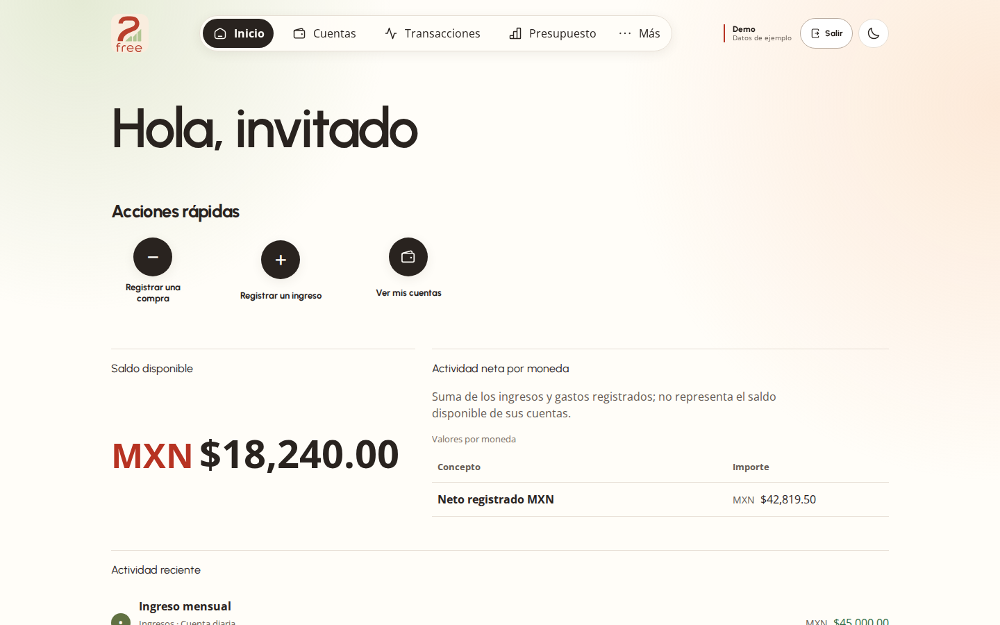
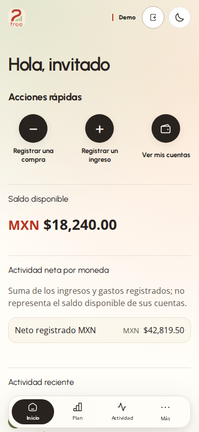

<p align="center">
  
</p>

<h1 align="center">2 Free</h1>

<p align="center">
  Finanzas personales abiertas, local-first y bajo su control.
</p>

<p align="center">
  <a href="https://github.com/camircode/2free/actions/workflows/quality.yml"></a>
  <a href="https://github.com/camircode/2free/releases/latest"></a>
  <a href="LICENSE"></a>
</p>

2 Free reúne cuentas, transacciones, presupuestos, metas, gastos compartidos y alertas en una misma
experiencia. Puede trabajar completamente en el dispositivo con SQLCipher, sincronizarse con el
servicio administrado o conectarse a una instancia propia.

## Descargar

| Plataforma | Artefacto                                                                                         | Compatibilidad    |
| ---------- | ------------------------------------------------------------------------------------------------- | ----------------- |
| Linux      | [Descargar AppImage](https://github.com/camircode/2free/releases/latest/download/2-Free.AppImage) | x86_64            |
| Android    | [Descargar APK](https://github.com/camircode/2free/releases/latest/download/2-Free.apk)           | Android 7+, ARM64 |

Los binarios y `SHA256SUMS.txt` se publican juntos en [GitHub Releases](https://github.com/camircode/2free/releases).
El APK está firmado por el proyecto; Android puede solicitar autorización para instalar aplicaciones
fuera de la tienda.

## Experiencia

| Escritorio                                                                                                                      | Móvil                                                                                                                     |
| ------------------------------------------------------------------------------------------------------------------------------- | ------------------------------------------------------------------------------------------------------------------------- |
|  |  |

Estas capturas muestran el modo invitado disponible en la web, sin registro ni datos reales. La misma
arquitectura visual se adapta a web, AppImage y Android. Los flujos complejos aparecen bajo demanda,
los montos se calculan sin punto flotante binario y el modo local no requiere cuenta ni red.

## Tecnologías

| Área               | Tecnologías                                                  |
| ------------------ | ------------------------------------------------------------ |
| Web                | Next.js 16, React 19, TypeScript 5.9, Tailwind CSS 4         |
| API                | NestJS 11, Better Auth, class-validator                      |
| Datos cloud        | PostgreSQL 16, Prisma 7, AES-256-GCM                         |
| Escritorio y móvil | Tauri 2, Rust, Vite 8, SQLCipher, almacén seguro del sistema |
| Landing            | Astro 6, GSAP, fuentes locales                               |
| Calidad            | Vitest 4, Playwright, ESLint, Prettier, GitHub Actions       |
| Infraestructura    | pnpm workspaces, Docker Compose                              |

## Inicio rápido

### Docker Compose

Requiere Docker Engine con Compose v2. No necesita Node.js.

```bash
cp .env.example .env
docker compose up -d --build
docker compose ps
curl http://localhost:3001/health
curl http://localhost:3000/health
```

Abra `http://localhost:3000`. PostgreSQL permanece en el volumen `postgres_data`; la API solo se
publica en `127.0.0.1:3001` y la migración debe terminar antes de iniciar los servicios.

La landing opcional se inicia con:

```bash
docker compose --profile landing up -d --build
```

Queda disponible en `http://localhost:4321`.

### Desarrollo

Requiere Node.js `24.18.0`, Corepack y pnpm `11.13.1`.

```bash
corepack enable
pnpm install --frozen-lockfile
pnpm dev
```

| Comando                                                       | Resultado                                          |
| ------------------------------------------------------------- | -------------------------------------------------- |
| `pnpm dev`                                                    | API y web en modo desarrollo                       |
| `pnpm dev:landing`                                            | Landing Astro en `localhost:4321`                  |
| `pnpm tauri:dev`                                              | Aplicación Tauri con runtime nativo                |
| `pnpm check`                                                  | Formato, lint, tipos y pruebas unitarias           |
| `pnpm test:browser`                                           | Pruebas de interacción y accesibilidad en Chromium |
| `pnpm build:landing`                                          | Landing estática de producción                     |
| `pnpm --filter @2free/desktop tauri build --bundles appimage` | AppImage para Linux                                |

## Configuración

`.env.example` funciona como contrato documentado y como entorno local de referencia. Cada variable
incluye propósito, alcance y advertencias de seguridad.

| Variable                   | Responsabilidad                                                  |
| -------------------------- | ---------------------------------------------------------------- |
| `POSTGRES_*`               | Base, usuario y contraseña que usa Compose                       |
| `DATABASE_URL`             | Conexión para migraciones y procesos ejecutados fuera de Compose |
| `BETTER_AUTH_SECRET`       | Firma de sesiones; mínimo 32 caracteres                          |
| `BETTER_AUTH_URL`          | URL pública de Better Auth                                       |
| `TRUSTED_ORIGINS`          | Orígenes exactos autorizados para web y Tauri                    |
| `DATA_ENCRYPTION_KEY`      | 32 bytes en base64 para cifrado AES-256-GCM                      |
| `API_URL`                  | URL interna que usa Next.js dentro de Compose                    |
| `NEXT_PUBLIC_API_URL`      | URL de la API visible para el navegador                          |
| `PUBLIC_GITHUB_REPOSITORY` | Repositorio usado por la landing para resolver descargas         |
| `VITE_CLOUD_API_URL`       | API administrada sugerida por Tauri; vive en `apps/desktop/.env` |

**No cambie `DATA_ENCRYPTION_KEY` sobre datos existentes.** La clave no se guarda en PostgreSQL y
todavía no existe un comando de recifrado. En producción, genere secretos nuevos y guárdelos fuera
del repositorio.

```bash
openssl rand -base64 48 # BETTER_AUTH_SECRET
openssl rand -base64 32 # DATA_ENCRYPTION_KEY
```

## Arquitectura

```text
apps/
├── api/       NestJS, Better Auth y casos de uso financieros
├── desktop/   Tauri para Linux y Android
├── landing/   Sitio público Astro
└── web/       Aplicación Next.js

packages/
├── application/    Casos de uso y composición
├── auth/           Configuración de identidad y sesiones
├── core/           Dinero exacto e invariantes financieras
├── data-provider/  Puertos local/cloud y portabilidad
├── database/       Prisma, PostgreSQL, migraciones y cifrado
└── ui/             Sistema visual compartido
```

El dominio y los contratos viven fuera de los frameworks. La web usa PostgreSQL mediante la API;
Tauri mantiene SQLCipher como origen local y replica opcionalmente cambios mediante una cola cifrada.

## Privacidad y respaldo

- Nunca se solicita ni almacena un número de tarjeta completo o parcial.
- Los nombres y metadatos sensibles de PostgreSQL usan sobres AES-256-GCM autenticados.
- Tauri verifica `PRAGMA cipher_version` y falla de forma cerrada si SQLCipher no está disponible.
- La clave local vive en Keychain, Credential Manager, Secret Service o Android Keystore.
- La importación portable se valida completa y se aplica de manera transaccional.

Respaldo de una instancia propia:

```bash
docker compose exec -T db pg_dump -U 2free -d 2free -Fc > 2free.dump
docker compose exec -T db pg_restore -U 2free -d 2free --clean --if-exists < 2free.dump
```

Respalde también `DATA_ENCRYPTION_KEY`; sin ella, los campos cifrados no se pueden recuperar. Para el
modo local consulte [`apps/desktop/README.md`](apps/desktop/README.md).

## Releases reproducibles

Las etiquetas `v*` ejecutan `.github/workflows/release.yml`, que:

1. Compila y empaqueta el AppImage x86_64.
2. Compila el APK ARM64 con Rust, NDK 29 y JDK 21.
3. Verifica la firma del APK.
4. Publica ambos artefactos y sus checksums en la release.

El workflow requiere los secretos `ANDROID_KEY_ALIAS`, `ANDROID_KEY_PASSWORD` y
`ANDROID_KEY_BASE64`. La clave privada nunca se guarda en Git.

## Licencia

2 Free se distribuye bajo [`AGPL-3.0-only`](LICENSE). Si modifica el programa y permite que otras
personas interactúen con esa versión mediante una red, debe ofrecerles el código fuente
correspondiente según la sección 13 de la licencia.
